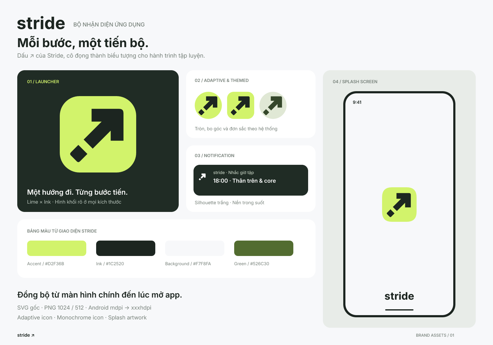

# Bộ icon Stride



Bộ tài sản độc lập để gắn thủ công, dựa trên giao diện trong `docs/figma`: xanh lime `#D2F36B`, nét `#1C2520`, nền splash `#F7F8FA`. Dấu ↗ có phần đuôi tách thành một bước tiến; wordmark sử dụng logo Stride có sẵn.

## Tệp thiết kế

Các tệp nằm trong `assets/branding/`:

| Tệp | Nội dung |
| --- | --- |
| `launcher_icon.svg/.png` | Launcher nền kín, PNG 1024 × 1024, chưa bo góc |
| `play_store_icon_512.png` | PNG 512 × 512 |
| `stride_mark.svg` | Biểu tượng vector, nền trong suốt |
| `launcher_foreground.svg/.png` | Foreground adaptive, PNG 432 × 432 |
| `launcher_monochrome.svg/.png` | Biểu tượng đơn sắc, PNG 432 × 432 |
| `notification_icon.svg/.png` | Nét trắng trên nền trong suốt, PNG 96 × 96 |
| `splash_icon.svg/.png` | Logo splash trên canvas trong suốt, PNG 1152 × 1152 |
| `splash_branding.svg/.png` | Wordmark splash, PNG 800 × 320 |

Các tệp xem trước nằm trong `docs/branding/`:

- `preview.svg/.png`: toàn bộ bộ thiết kế.
- `splash_preview.svg/.png`: splash nền sáng 390 × 844; PNG 1170 × 2532.

## Bộ xuất Android

`assets/branding/android/res/` chứa tài nguyên để bạn chọn và chép thủ công:

- `mipmap-mdpi` đến `mipmap-xxxhdpi`: launcher bo góc và tròn, kích thước 48, 72, 96, 144, 192 px.
- `mipmap-anydpi-v26` và `mipmap-anydpi-v33`: adaptive icon và phiên bản có lớp monochrome.
- `drawable/`: vector foreground, monochrome và logo splash.
- `drawable-anydpi/`: notification vector `ic_stat_stride.xml`.
- `drawable-mdpi` đến `drawable-xxxhdpi`: notification PNG 24, 36, 48, 72, 96 px.
- `values/brand_colors.xml`: màu nền được các adaptive XML tham chiếu.

Notification dùng hình trắng trên nền trong suốt. Splash gồm logo, wordmark và màu nền riêng để bạn bố trí khi tích hợp.

## Xuất lại

```sh
npm ci --prefix tools/branding
npm run generate --prefix tools/branding
```

Nguồn hình học và màu nằm trong `tools/branding/generate.mjs`. Script chỉ xuất vào `assets/branding/` và `docs/branding/`; không sửa manifest, theme, tài nguyên đang dùng trong `android/` hoặc `pubspec.yaml`.

Đã kiểm tra kích thước PNG, nền trong suốt của notification, vùng an toàn adaptive và tính nhất quán khi xuất lại.
